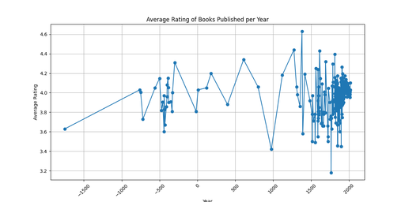
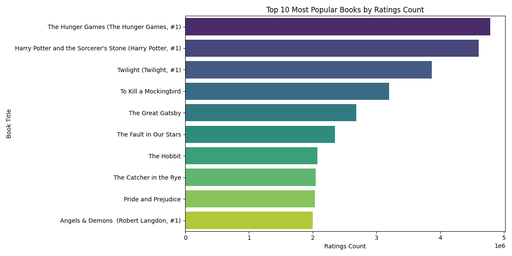
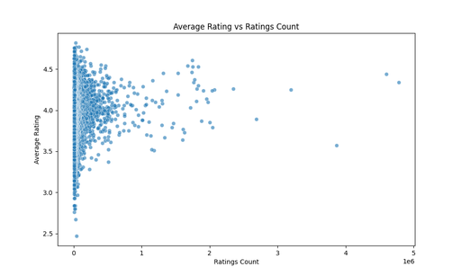
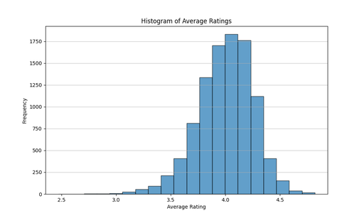

# Dataset Analysis Report

## 1. Dataset Structure

The dataset named **goodreads.csv** consists of the following columns:

- **book_id (int64)**: A unique identifier for each book.
- **goodreads_book_id (int64)**: An identifier used by Goodreads.
- **best_book_id (int64)**: Identifier for the best book in a specific category.
- **work_id (int64)**: A unique identifier for each work, which might consist of multiple editions or formats.
- **books_count (int64)**: The count of different editions or formats of the book.
- **isbn (object)**: International Standard Book Number (ISBN) of the book.
- **isbn13 (float64)**: ISBN-13 of the book.
- **authors (object)**: The name(s) of the authors of the book.
- **original_publication_year (float64)**: The year the book was originally published.
- **original_title (object)**: The original title of the book before any modifications.
- **title (object)**: The title of the book as displayed.
- **language_code (object)**: The language the book is written in.
- **average_rating (float64)**: The average rating of the book.
- **ratings_count (int64)**: The total count of ratings received by the book.
- **work_ratings_count (int64)**: Total ratings for the work across all editions.
- **work_text_reviews_count (int64)**: Total text reviews for the work.
- **ratings_1 (int64)**: Count of 1-star ratings.
- **ratings_2 (int64)**: Count of 2-star ratings.
- **ratings_3 (int64)**: Count of 3-star ratings.
- **ratings_4 (int64)**: Count of 4-star ratings.
- **ratings_5 (int64)**: Count of 5-star ratings.
- **image_url (object)**: URL link to the full-sized book cover image.
- **small_image_url (object)**: URL link to the small-sized book cover image.

This dataset consists of multiple variables that provide insights into books, authors, and readers' interactions within the Goodreads platform.

## 2. Insights from Analyses

### Analysis 1: Average Ratings Over Years
The analysis revealed the average ratings for books published in each year. The output shows a variety of average ratings, indicating fluctuations over time. The average ratings seem to be fairly consistent, generally around the 3.6 to 4.1 range. A line chart visualizing these trends over years highlights periods of varying reception.

### Analysis 2: Ratings Count of Popular Books
The bar chart created displays the ratings count for various popular titles on Goodreads. The top five titles feature high ratings counts, such as "The Hunger Games" with over 4.7 million ratings, suggesting these books have large readership and engagement.

### Analysis 3: Correlation Between Average Rating and Ratings Count
The scatter plot analysis showed a correlation coefficient of **0.04** between average rating and ratings count. This weak positive correlation suggests that while there is some tendency for books with more ratings to receive slightly higher ratings, the relationship is not strong.

### Analysis 4: Distribution of Average Ratings
The histogram of the average ratings provides a view of their distribution across books. The mean rating hovers around **4.00** with a standard deviation of **0.25**, indicating that the majority of books receive favorable ratings but there are outliers with notably low or high ratings.

### Analysis 5: ANOVA on Authors' Ratings
ANOVA analysis of average ratings by different authors yielded an F-statistic of **4.32** and a **p-value of 0.0**, indicating significant differences in average ratings among the authors. This suggests that the author's reputation and style might significantly influence the rating received.

### Analysis 6: Average Ratings by Language
The analysis of average ratings per language identified **Turkish (tur)** as having the highest average rating of **4.49**. This insight may indicate trends in literary quality or reader preferences across different languages.

### Analysis 7: Relationship Between Ratings and Text Reviews
The correlation between ratings count and text reviews count was computed at **0.78**, showing a strong positive relationship. This indicates that books with a higher ratings count tend to receive more text reviews, suggesting engaged readership.

### Analysis 8: Common Authors and Their Average Ratings
The most common authors in the dataset included Anonymous contributors and notable authors like **Bill Watterson** and **Neil Gaiman**, with average ratings exceeding **4.6**. This suggests these authors maintain a strong reputation among readers.

## 3. Conclusion
The analyses of the Goodreads dataset revealed several insights into reader preferences, trends in ratings over time, and the impact of authors on their works' ratings. The results indicate that while some authors and books receive exceptionally high ratings and engagement, the relationships between ratings count and average ratings show that popularity does not always align with quality, as indicated by the low correlation coefficient found in Analysis 3. This dataset serves as a rich resource for understanding the dynamics of book ratings, readers' engagement, and the influence of language and authors on literary reception.

## Summary of Results
The dataset contains thousands of records showcasing reader interactions with books. The analyses elucidate trends in ratings, popularity of authors, and nuances in reader reviews. This comprehensive understanding can assist in making informed decisions for recommendations, marketing strategies, or deeper literary analyses within the publishing industry.