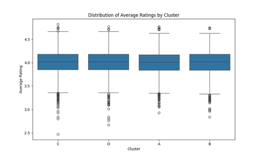
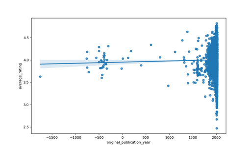
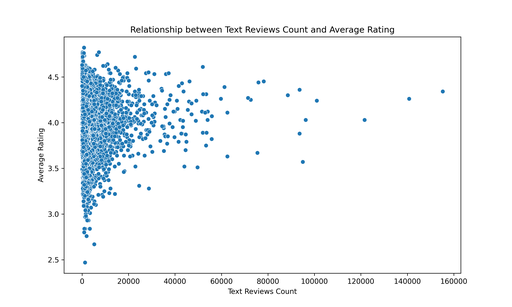
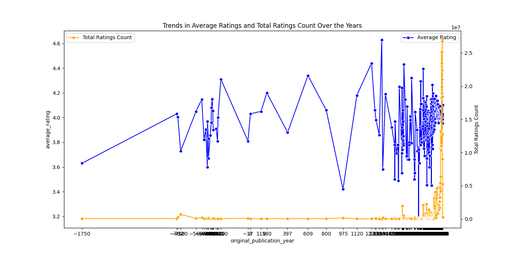

# Dataset Analysis Report

## 1. Dataset Structure

The dataset, named `goodreads.csv`, consists of various details about books that have been rated by users on the Goodreads platform. It comprises the following columns:

- **book_id**: Integer unique identifier for the book.
- **goodreads_book_id**: Integer identifier specific to Goodreads.
- **best_book_id**: Integer identifier for the book determined by Goodreads.
- **work_id**: Integer identifier associated with the work.
- **books_count**: Integer indicating the number of editions of the book.
- **isbn**: Object storing the International Standard Book Number.
- **isbn13**: Floating point number representing the 13-digit ISBN.
- **authors**: Object listing the authors of the book.
- **original_publication_year**: Float indicating the year the book was originally published.
- **original_title**: Object showing the original title of the book.
- **title**: Object showing the title of the book.
- **language_code**: Object indicating the language of the book.
- **average_rating**: Floating point number representing the average rating of the book.
- **ratings_count**: Integer representing the total count of ratings received.
- **work_ratings_count**: Integer representing ratings for the work.
- **work_text_reviews_count**: Integer indicating the count of text reviews.
- **ratings_1** to **ratings_5**: Integer counts of 1 to 5-star ratings respectively.
- **image_url**: Object storing the URL of the book's cover image.
- **small_image_url**: Object storing the URL of a smaller version of the book's cover image.
- **Cluster**: Integer indicating the cluster assignment for segmentation.
- **cluster**: Object representing a categorical identification of clusters.

### Data Types
The dataset consists of various data types: `int64`, `float64`, and `object` (string). Key numerical columns include average ratings, counts, and publication years, which provide a quantitative insight into the ratings and book characteristics.

## 2. Analysis Insights

### Analysis 1: Ratings Distribution by Cluster
- **Result**: 

```
Average Rating Summary by Cluster:
           count      mean       std   min   25%   50%   75%   max
cluster                                                          
A        2536.0  3.999594  0.247551  2.93  3.84  4.01  4.17  4.77
B        2486.0  3.998813  0.253436  2.84  3.84  4.02  4.18  4.75
C        2477.0  4.004647  0.261936  2.47  3.85  4.02  4.18  4.82
D        2501.0  4.005750  0.254823  2.67  3.85  4.02  4.18  4.77
```

- **Insight**: Clusters C and D have slightly higher average ratings compared to A and B, although all clusters hover around 4.00 on average. The variance in ratings is relatively low across clusters, indicating consistent satisfaction level among users for the books categorized into these clusters.



### Analysis 2: Original Publication Year vs. Average Ratings
- **Result**: 
  - Correlation between publication year and average rating: **0.0156**
  - A graph was created that shows the relationship between the publication year and average ratings.



- **Insight**: The weak positive correlation (0.0156) suggests that there’s no significant relationship between the publication dates of books and their ratings. Although there are some historical anomalies, newer books do not necessarily receive better ratings.

### Analysis 3: Text Reviews Count vs. Average Ratings
- **Result**: 
  - Correlation between text reviews count and average rating: **0.0075**
  - A chart visualizing the relationship was generated.



- **Insight**: The negligible correlation indicates that the volume of text reviews does not have a substantial impact on the average ratings of books. This implies that books can have varying degrees of ratings irrespective of the amount of textual feedback provided by users.

### Analysis 4: Trends Analysis Over Years
- **Result**: 
  - A time series analysis chart was created showing ratings trends over the years, including descriptive statistics on average ratings and total ratings count.



- **Insight**: The average rating over time suggests an overall positive reception of books published, but with variations in user engagement (indicated by the total ratings count). Trends can identify shifts in reading preferences, highlighting how different decades bring varied engagement and tastes.

## 3. Conclusion

The dataset provided valuable insights into user satisfaction as represented by average ratings of books across various dimensions. The analyses explored the relationship between clustering of books according to their ratings, original publication years, text reviews, and trends of popularity over years. While the clusters exhibited relatively consistent average ratings, the relationships with publication year and text reviews showed weak correlations, indicating other factors may influence reader ratings beyond mere historical context or review volume. 

In summary, while trends in ratings suggest evolving reader preferences, the majority of books exhibit satisfaction ratings consistently around the 4.0 mark, indicating a generally positive reader sentiment on the Goodreads platform.

---

**Summary of Dataset and Analysis Results**:
- The dataset contains comprehensive information on books, ratings, and user engagement as reflected in text reviews.
- Ratings vary slightly across clusters but generally remain high.
- Newer publications do not necessarily correlate with higher average ratings.
- Review volume lacks significant correlation with ratings, suggesting quality over quantity in feedback.
- Overall positive trends in book ratings reflect a robust reader engagement on Goodreads.