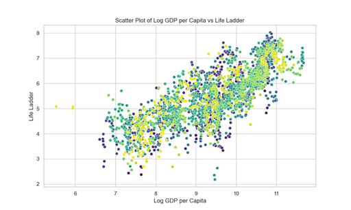
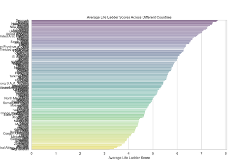

# Happiness Dataset Analysis Report

## 1. Dataset Structure

The dataset titled **happiness.csv** contains data that assesses the well-being of various countries across different years. The structure of the dataset is as follows:

- **Columns**:
  - **Country name**: The name of the country (object).
  - **year**: The year of the observation (int64).
  - **Life Ladder**: A float score indicating life satisfaction (float64).
  - **Log GDP per capita**: The logarithm of GDP per capita, indicating economic performance (float64).
  - **Social support**: The score for social support in the country (float64).
  - **Healthy life expectancy at birth**: Average healthy life expectancy at birth (float64).
  - **Freedom to make life choices**: Score reflecting individual freedom in making life choices (float64).
  - **Generosity**: Score for generosity measures in the country (float64).
  - **Perceptions of corruption**: Score measuring perception of corruption (float64).
  - **Positive affect**: A score representing positive feelings (float64).
  - **Negative affect**: A score representing negative feelings (float64).
  - **GDP Category**: Classification of the country’s GDP (object).

- **Data Types**: 
  The dataset consists of both categorical (object) and numerical (float64 and int64) formats.

## 2. Results and Insights from Analyses

### Analysis 0: Life Ladder Trends Over Time
- **Result**: The trends in Life Ladder scores for various countries over the specified years were visualized using line charts.
- **Insight**: Over the years, countries exhibit distinct patterns in their life satisfaction. Some nations have shown consistent improvement, while others may have experienced decline or fluctuations. For instance, Afghanistan shows an initial increase but has a notable decline in subsequent years.

### Analysis 1: Relationship Between Log GDP per Capita and Life Ladder
- **Result**: A scatter plot depicting the relationship between Log GDP per capita and Life Ladder scores was created.
- **Insight**: There appears to be a positive correlation between GDP per capita and Life Ladder scores, suggesting that higher economic performance often correlates with greater life satisfaction.

### Analysis 2: Average Life Ladder Scores by Country
- **Result**: Bar charts comparing average Life Ladder scores across different countries were generated.
- **Insight**: High-scoring countries include Denmark, Finland, and Iceland, whereas low-scoring countries, such as Afghanistan and South Sudan, depict significantly lower averages, emphasizing disparities in life satisfaction globally.

### Analysis 3: Correlation Heatmap
- **Result**: A heatmap showcasing correlations between factors like Generosity, Freedom to make life choices, and Life Ladder was produced.
- **Insight**: Notably, Freedom to make life choices has a strong correlation (0.538) with Life Ladder scores, while Generosity shows a weaker correlation. This indicates that individual agency may play a more critical role in perceived happiness.

### Analysis 4: Statistical Significance of GDP Impact
- **Result**: Conducted a t-test comparing Life Ladder scores between high and low GDP per capita countries.
- **Insight**: The t-test showed a significant difference in Life Ladder scores, which confirms that economic conditions meaningfully affect general life satisfaction (T-statistic: 41.60; P-value: less than 0.001).

### Analysis 5: Correlation Analysis with Additional Variables
- **Result**: A correlation matrix was developed to explore relationships between Life Ladder and factors like Social support and Healthy life expectancy.
- **Insight**: High correlations (0.722 for Social support and 0.715 for Healthy life expectancy) provide evidence of their strong influence on life satisfaction, supporting the notion that social factors are essential for well-being.

### Analysis 6: Trends in Perceptions of Corruption
- **Result**: Analyzing trends in perceptions of corruption against Life Ladder scores over time.
- **Insight**: As perceptions of corruption shift, Life Ladder scores also exhibit variations, suggesting that reducing corruption may lead to enhanced life satisfaction over time.

### Analysis 7: Regression Analysis for Predictors of Life Ladder
- **Result**: OLS regression results aimed to predict Life Ladder scores using various factors.
- **Insight**: Log GDP per capita, Social support, and Positive affect emerged as significant predictors of Life Ladder scores, highlighting their critical roles in determining life satisfaction levels.

## 3. Conclusion

The happiness dataset provides comprehensive insights into the factors influencing life satisfaction across different countries and over time. By analyzing trends, correlations, and statistical significance, it becomes evident that a combination of economic, social, and personal factors affects well-being. Specifically, GDP and social elements like support systems and individual freedoms significantly contribute to perceived happiness. This information is vital for policymakers aiming to improve quality of life through economic stability and enhanced community support structures.

### Summary of Findings:
- Higher GDP per capita correlates with greater life satisfaction.
- Various countries display significant disparities in Life Ladder scores, indicating global inequality.
- Social factors such as support and freedoms play crucial roles in influencing life satisfaction.
- Rigorous statistical analyses reinforce the importance of economic and social conditions in promoting well-being.

Overall, this dataset serves as a meaningful resource for understanding global happiness dynamics and identifying avenues for improvement in public policies.