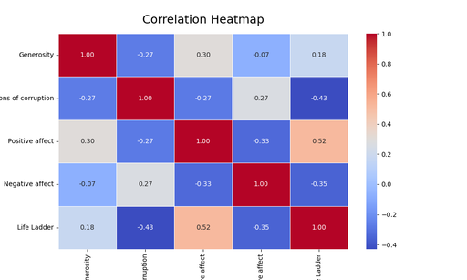

## Dataset Summary

The dataset titled **"happiness.csv"** consists of a collection of happiness indicators across different countries over varying years. The dataset contains 165 entries with several columns capturing essential metrics related to happiness and well-being:

### Dataset Structure

- **Columns**:
  1. **Country name**: The name of the country (data type: object).
  2. **Year**: The year of the recorded data (data type: int64).
  3. **Life Ladder**: A measure of overall life satisfaction, represented as a float value (data type: float64).
  4. **Log GDP per capita**: The logarithm of Gross Domestic Product per capita, represented as a float value (data type: float64).
  5. **Social support**: A measure of perceived support provided by family and friends, represented as a float value (data type: float64).
  6. **Healthy life expectancy at birth**: The expected number of years of life in good health at birth, represented as a float value (data type: float64).
  7. **Freedom to make life choices**: A measure of autonomy in life decisions, represented as a float value (data type: float64).
  8. **Generosity**: A measure of charitable behaviors and attitudes, represented as a float value (data type: float64).
  9. **Perceptions of corruption**: The perceptions regarding corruption in the government and business sectors, represented as a float value (data type: float64).
  10. **Positive affect**: A measure of positive feelings and emotions experienced by individuals, represented as a float value (data type: float64).
  11. **Negative affect**: A measure of negative feelings and emotions experienced by individuals, represented as a float value (data type: float64).
  12. **Cluster**: A categorical grouping of countries based on similar happiness indicators (data type: int32).

## Detailed Insights from Analyses

### Analysis 1: Time Series Analysis
The first analysis involved investigating trends in the **Life Ladder** and other happiness indicators over the years across various countries.

#### Result:
The analysis generated a list of Life Ladder scores for different countries, showcasing a diverse range in happiness levels, with Afghanistan showing a very low score of approximately 3.22, in stark contrast to Argentina which scored around 6.29.

The chart titled "life_ladder_trends.png" illustrates the variations in Life Ladder scores across different countries over time. Observing individual country trends can reveal which nations are improving, declining, or maintaining their happiness levels.

### Analysis 2: Comparative Analysis
This analysis compared Life Ladder scores across different clusters to identify notable differences.

#### Result:
The average Life Ladder scores across clusters were:
- Cluster 0: 5.95
- Cluster 1: 4.30
- Cluster 2: 5.82

An ANOVA analysis revealed a highly significant difference between clusters (F-statistic: 733.84, p-value < 0.001), indicating that clusters have substantially different levels of well-being.

### Analysis 3: Impact of GDP and Social Support
Regression analysis was performed to understand how **Log GDP per capita** and **Social support** predict **Life Ladder** scores.

#### Result:
The regression model had an R-squared value of **0.676**, indicating that approximately 67.6% of the variance in Life Ladder scores can be explained by the two predictors. 

**Coefficients**:
- Log GDP per capita: **0.531** (indicating a positive relationship)
- Social support: **3.210** (strong positive impact)

Both predictors were statistically significant (p-values < 0.001).

In the chart titled "impact_of_gdp_and_social_support.png," we can observe the relationship between GDP and social support alongside their impact on happiness scores.

### Analysis 4: Correlational Insights
This analysis examined the relationships between **Generosity**, **Perceptions of corruption**, and **Positive/Negative affect** to determine their collective impact on overall happiness.

#### Correlation Matrix:
- Generosity: (0.18 with Life Ladder)
- Perceptions of corruption: (-0.43 with Life Ladder)
- Positive affect: (0.52 with Life Ladder)
- Negative affect: (-0.35 with Life Ladder)

The correlation heatmap visually presents the interrelationships among various dimensions of happiness. Notably, the strongest positive correlation is found between **Positive affect** and **Life Ladder** (0.52), highlighting the importance of positive emotions in overall life satisfaction.

## Conclusion

The analysis of the **happiness.csv** dataset reveals significant insights into global happiness metrics. The robust examination of trends, cluster comparisons, and regression analyses collectively underline the importance of economic and social factors such as GDP and social support in determining well-being. The impact of emotional states and perceptions of corruption is also crucial in understanding the variance in happiness across different populations. 

The visual representations from each analysis enhance our understanding of the intricate relationships and trends within the data, ultimately guiding policymakers and researchers in promoting happiness and well-being worldwide. 

### Summary of Dataset and Analysis Results
- The dataset consists of happiness indicators across various nations.
- Trends, disparities among clusters, and the impact of GDP and social support provide actionable insights.
- Positive affect emerged as a significant contributor to life satisfaction, while perceptions of corruption negatively affected happiness.
- These results are essential for framing interventions aimed at improving overall well-being globally.