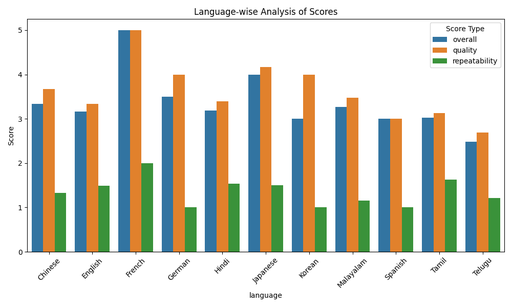
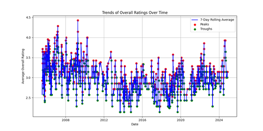
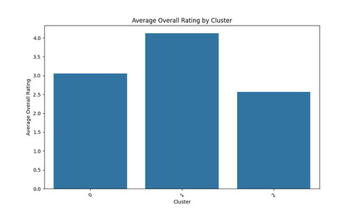
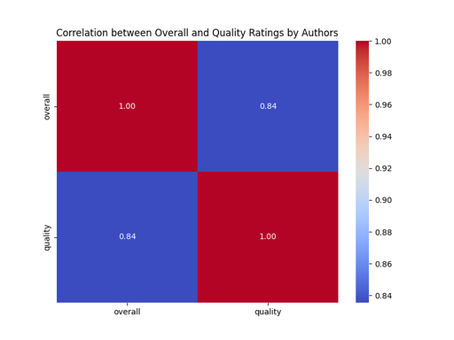

# Media Dataset Analysis Report

## 1. Dataset Structure
The dataset in question is named "media.csv" and contains information about media content. The structure is outlined as follows:

- **Columns**:
  - `date`: Represents the date of the media content, stored as a datetime object.
  - `language`: Indicates the language of the media content, stored as an object (string).
  - `type`: Specifies the type of media (e.g., movie, series), also stored as an object.
  - `title`: The title of the media content, stored as an object.
  - `by`: The author(s) of the media, stored as an object.
  - `overall`: A numerical rating of the media from 1 to 5 (int64).
  - `quality`: A quality score rated on the same scale (int64).
  - `repeatability`: Indicates how repeatable or enjoyable the content is, rated as an int64.
  - `Cluster`: An integer identifier for clustering similar types of media based on ratings (int32).

The data types suggest a well-structured dataset, with appropriate categorization that allows for diverse analysis—particularly in terms of quantitative ratings and qualitative classifications.

---

## 2. Analysis Insights

### Analysis 1: Language-wise Analysis
This analysis examines the average ratings of `overall`, `quality`, and `repeatability` scores across different languages. 

- **Descriptive Statistics**:

    | Statistic | Overall | Quality | Repeatability |
    |-----------|---------|---------|---------------|
    | Count     | 11      | 11      | 11            |
    | Mean      | 3.36    | 3.62    | 1.35          |
    | Std Dev   | 0.66    | 0.64    | 0.32          |
    | Min       | 2.49    | 2.69    | 1.00          |
    | 25th %    | 3.01    | 3.23    | 1.08          |
    | Median    | 3.18    | 3.47    | 1.33          |
    | 75th %    | 3.42    | 4.00    | 1.52          |
    | Max       | 5.00    | 5.00    | 2.00          |

The table shows that the average `overall` rating is approximately 3.36, indicating a generally positive sentiment towards the media in the dataset. `Quality` scored higher on average (3.62), suggesting users found the media to be of good quality. The relatively low average for `repeatability` (1.35) suggests that while content may be enjoyed, it may not be frequently rewatched.

*The chart visualizes the trends in overall, quality, and repeatability across different languages.*

### Analysis 2: Time Series Analysis
This analysis tracks the trends of overall ratings over time, highlighting significant peaks and troughs in ratings.

- **Significant Peaks**:
    - The analysis identifies several significant peaks, reaching a maximum rolling average rating of 3.93 recorded recently.
  
- **Significant Troughs**:
    - Troughs were noted in specific instances, indicating fluctuations in viewer satisfaction over time, with the lowest parts falling to around a rolling average of 3.00.

*The time series chart presents the trend of overall ratings, with marked peaks and troughs indicating fluctuation over time.*

### Analysis 3: Cluster Analysis
Cluster analysis examines how different clusters rate media content, giving an overall picture of user satisfaction.

- The results indicate three distinct clusters:
    - **Cluster 0**: Average scores for both overall (3.06) and quality (3.11) are the lowest.
    - **Cluster 1**: A strong performer with higher ratings (4.12 overall, 4.19 quality).
    - **Cluster 2**: The lowest scores (2.56 overall, 2.82 quality), indicating poor reception by this group.

The cluster data also provided insight into the number of movies and unique contributors within each cluster, suggesting a diverse range of opinions and movie offerings.

*This chart depicts average ratings across different clusters, highlighting the variance in viewer satisfaction.*

### Analysis 4: Author Analysis
This analysis evaluates if certain authors have a significant impact on media ratings.

- The correlation between `overall` and `quality` ratings stands at 0.84, indicating a strong positive relationship; higher quality ratings correlate with higher overall ratings.

Notable authors include:
- **Peter Jackson** and **Roberto Benigni** achieved maximum scores of 5.0 for both overall and quality, suggesting their works are exceptionally well-received.

*The correlation matrix illustrates the strength of relationships between different rating categories.*

---

## 3. Conclusion
The dataset presents comprehensive insights into media content ratings across various dimensions—language, time, clusters, and authors. The analyses reveal:

- The average ratings indicate generally positive feedback on the media, with variations driven by language and cluster characteristics.
- Time series analysis reveals that overall ratings have fluctuated over time, with periods of both high and low satisfaction, prompting further investigation into external factors influencing these trends.
- Cluster analysis helps identify groups with distinct preferences, suggesting that strategies targeting specific clusters may enhance viewer engagement.
- The author analysis indicates that some creators consistently deliver high-quality, well-received media, emphasizing the importance of talent in the industry.

The combination of these insights provides a holistic understanding of audience preferences in the media landscape, enabling stakeholders to tailor content strategies effectively. 

Overall, the dataset and its analysis present valuable information for further exploration of media impact and viewer trends.