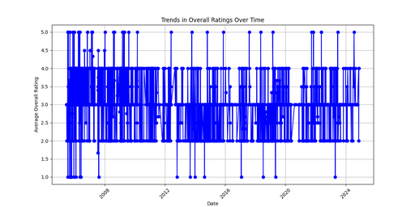
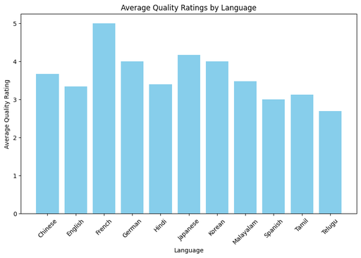
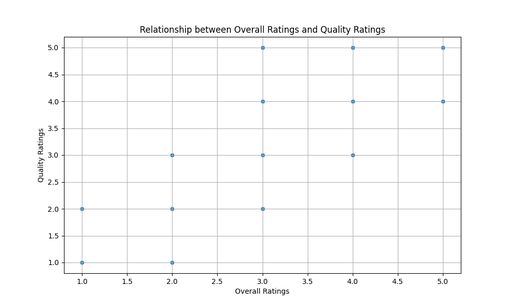
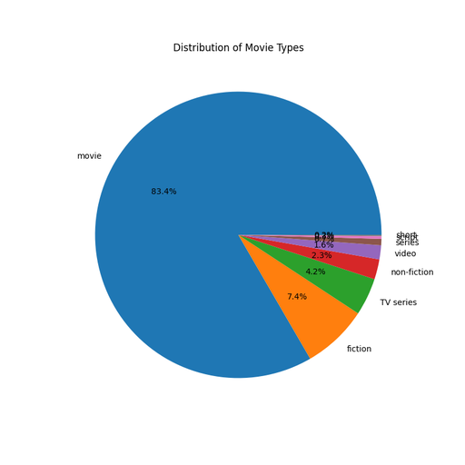

## Dataset Overview

The dataset `media.csv` contains data related to various media entries characterized by multiple attributes. Here’s a summary of its structure:

### Structure
- **Filename**: media.csv
- **Columns**:
  - `date`: A datetime64 column indicating when the media was rated.
  - `language`: An object column denoting the language of the media.
  - `type`: An object column representing the type of media (e.g., movie, TV series).
  - `title`: An object column containing the title of the media.
  - `by`: An object column indicating who rated the media.
  - `overall`: An int64 column representing the overall rating of the media on a scale (presumably 1 to 5).
  - `quality`: An int64 column for the quality rating on a similar scale.
  - `repeatability`: An int64 column measuring how consistently the same media piece receives similar ratings over time.

### Insights from Analyses

#### Analysis 1: Overall Ratings Trend Over Time
- **Result**: A line chart visualizing the trends in overall ratings over time was generated. This chart (saved as `overall_rating_trends.png`) showcases the patterns in ratings from June 2005 to November 2024. 

*Insight*: Slight fluctuations in overall ratings can be observed, with peaks and troughs indicating varying popularity or quality perceptions over time.

#### Analysis 2: Average Quality Ratings by Language
- **Result**: A bar chart comparing the average quality ratings across different languages was created and saved as `average_quality_by_language.png`.

*Insight*: The French language stands out with the highest average quality rating (5.0), followed by German (4.0) and Japanese (4.17). In contrast, Telugu has the lowest average quality rating (2.69). This indicates significant variation in perceived media quality across languages.

#### Analysis 3: Relationship Between Overall and Quality Ratings
- **Result**: A scatter plot analyzed the correlation between overall and quality ratings, saved as `scatter_plot_overall_quality.png`.

*Insight*: The correlation coefficient of approximately 0.83 between overall and quality ratings indicates a strong positive relationship, implying that higher quality ratings tend to lead to higher overall ratings.

#### Analysis 4: Distribution of Movie Types
- **Result**: A pie chart depicting the distribution of different movie types was created, showing that most entries are categorized as 'movies' (2211), followed by 'fiction' (196) and 'TV series' (112). 

*Insight*: The overwhelming majority of entries in this dataset is categorized as movies, suggesting that this dataset is primarily movie-focused.

#### Analysis 5: Correlation Analysis
- **Result**: The correlation between overall ratings and quality ratings was quantified to be 0.83.

*Insight*: This reinforces the findings from the scatter plot. The strong correlation confirms that higher quality ratings strongly correspond with higher overall ratings in the dataset.

#### Analysis 6: T-Test for Overall Ratings Across Languages
- **Result**: The T-statistic calculated was approximately 0.40 with a P-value of 0.686. 

*Insight*: A high P-value suggests no statistically significant difference in overall ratings among different languages, which indicates that the average ratings received across languages do not significantly vary.

#### Analysis 7: Repeatability Analysis
- **Result**: Titles were listed with their repeatability score. Titles like "Ullathai Allitha" had a repeatability score of 3, indicating consistent ratings.

*Insight*: The repeatability scores suggest some media entries are rated similarly over time, indicating consistent audience perception.

#### Analysis 8: Average Overall Ratings by Media Type
- **Result**: The analysis of average overall ratings for each type of media indicated that TV series have an average rating of 3.02, while non-fiction scored a bit higher at 3.30.

*Insight*: The average ratings suggest a generally positive audience perception toward non-fiction, with TV series trailing slightly behind.

### Conclusion
The dataset provides a comprehensive insight into media ratings across various categories, showcasing trends over time, comparisons across languages, the correlation between quality and overall ratings, and the distribution of different types of media. 

Overall, the analyses reveal that while certain languages and genres outperform others in terms of quality perceptions, there is a consistent relationship between quality and overall ratings. The high repeatability of certain titles underlines foundational audience loyalty or consistent evaluations, which can be pivotal for media producers or consumers seeking quality entertainment.

### Summary of the Dataset
The `media.csv` dataset serves as a valuable resource for understanding media ratings across multiple dimensions, shedding light on trends, language disparities, and audience consistency in ratings. Key findings point towards strong correlations between quality and overall ratings, with French media showcasing the highest perceived quality, while movies constitute the majority of the dataset. A general lack of statistical significance among language-based ratings indicates a need for further exploration in the dynamics of media perception.